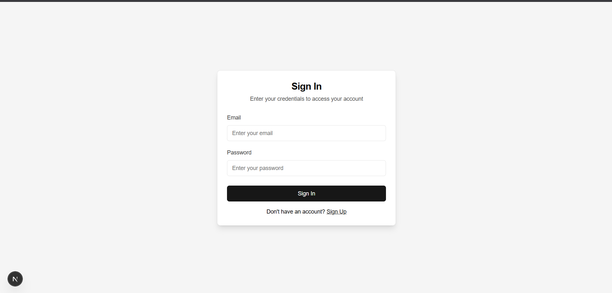
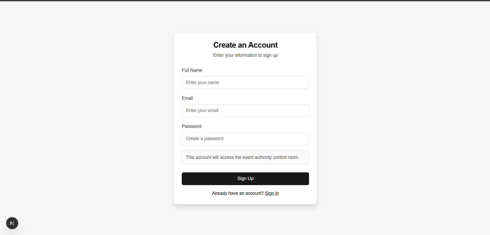

# CrowdResQ Control

CrowdResQ is a local AI-assisted event crowd monitoring system. It reads a fixed live camera feed, detects and tracks people, estimates density and movement risk, and alerts the event authority when stampede risk becomes high.

**Screenshots**




## 🎥 Demo

▶ **Full Demo:** [click](demo/demoVideo.mp4)

## What It Does

- Shows raw and AI-processed live feeds in one authority dashboard.
- Lets the user click calibration, entry, and exit points directly on the browser feed.
- Detects and tracks people with YOLO + ByteTrack/BoT-SORT fallback support from Ultralytics.
- Calculates density, congestion, movement flow, exit load, and crowd growth.
- Produces a live stampede-risk score and automatic alerts.

## Tech Stack

| Layer    | Stack                                                          |
| -------- | -------------------------------------------------------------- |
| Frontend | Next.js, React, TypeScript, Tailwind CSS, shadcn/ui, Recharts  |
| Backend  | FastAPI, Uvicorn, OpenCV, Ultralytics YOLO, NumPy              |
| Auth     | JWT cookie auth through Next.js API routes                     |
| Storage  | MongoDB for users, JSON files for scene setup and local alerts |

## Project Structure

```text
backend/
  app.py                  FastAPI app and API routes
  core/
    camera_worker.py      Live capture, detection, tracking, stream frames
    risk_engine.py        Density/movement/exit risk scoring
    scene_config.py       Calibration, entry, and exit point storage
    alert_manager.py      Automatic alert history
  data/
    scene_config.json     Local scene setup
  requirements.txt

frontend/
  app/
    dashboard/control/    Event authority dashboard
    api/auth/             Sign in, sign up, logout, current user
  components/             shadcn/ui components
  lib/                    MongoDB and auth helpers
```

## Local Testing

See [HOW_TO_RUN.md](HOW_TO_RUN.md) for exact setup and testing steps.
