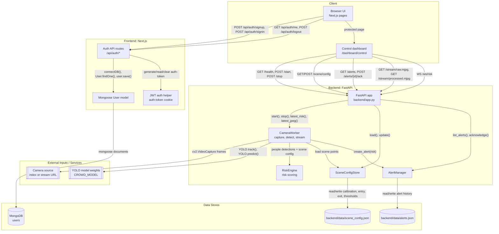

# CrowdResQ Control

CrowdResQ is a local AI-assisted event crowd monitoring system. It reads a fixed live camera feed, detects and tracks people, estimates density and movement risk, and alerts the event authority when stampede risk becomes high.

## Architecture

CrowdResQ is split into a Next.js control-room frontend and a FastAPI crowd-risk backend. The browser uses Next.js API routes for authority sign-up, sign-in, logout, and current-user checks, while the protected dashboard talks directly to the FastAPI service for camera control, scene setup, MJPEG video streams, alerts, and live risk updates over WebSocket. The backend starts a camera worker that reads frames with OpenCV, runs YOLO person detection/tracking, maps detections through the saved scene configuration, calculates risk scores, and writes high-risk alerts to local JSON storage. User accounts live in MongoDB through Mongoose, while scene calibration and alert history are stored in backend JSON files.

**Notes**

- No unverified edges are shown; each connection is backed by an opened source file, import, route handler, or explicit `fetch`/WebSocket call.
- Discovery covered project source/config/data files under `backend/`, `frontend/`, and root docs; generated dependency/build folders (`backend/venv/`, `frontend/node_modules/`, `frontend/.next/`) and binary demo assets were skipped.

**Screenshots**

## 🎥 Demo

▶ **Full Demo:** [click](https://drive.google.com/file/d/1yS_lbw1Yu-MHLP7pKeL1BIItW2d-gjw7/view?usp=sharing)

## Tech Used

| Area | Tech |
| --- | --- |
| Frontend app | Next.js App Router, React, TypeScript |
| UI | Tailwind CSS, shadcn/ui-style components, Radix UI primitives, lucide-react, Recharts |
| Frontend API/auth | Next.js API routes, JWT, HTTP-only auth cookie, bcryptjs |
| User storage | MongoDB through Mongoose |
| Backend API | FastAPI, Uvicorn, Pydantic, CORS middleware, WebSocket, MJPEG streaming |
| Computer vision | OpenCV, Ultralytics YOLO, NumPy |
| Backend storage | JSON files for scene configuration and alert history |
| Configuration | `frontend/.env`, backend environment variables such as `CROWD_MODEL`, `CAMERA_SOURCE`, `CROWD_CONF`, `CROWD_IOU`, and `CROWD_IMGSZ` |

## Local Testing

See [HOW_TO_RUN.md](HOW_TO_RUN.md) for exact setup and testing steps.
